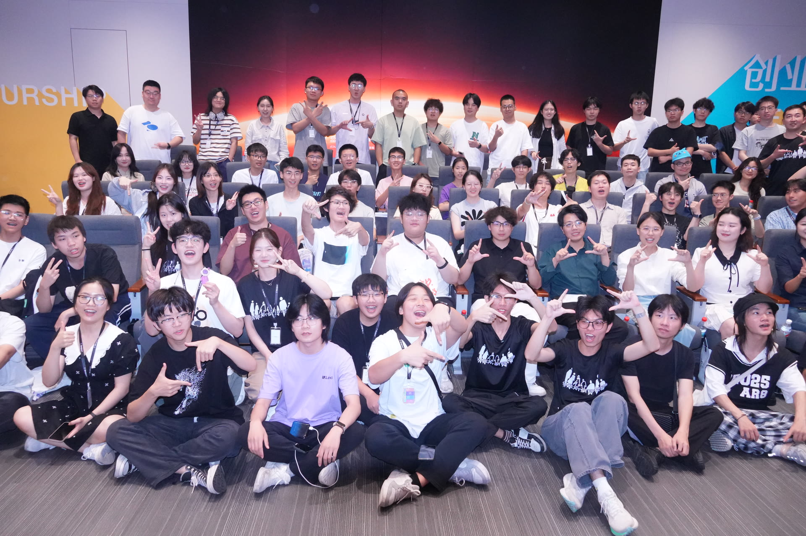
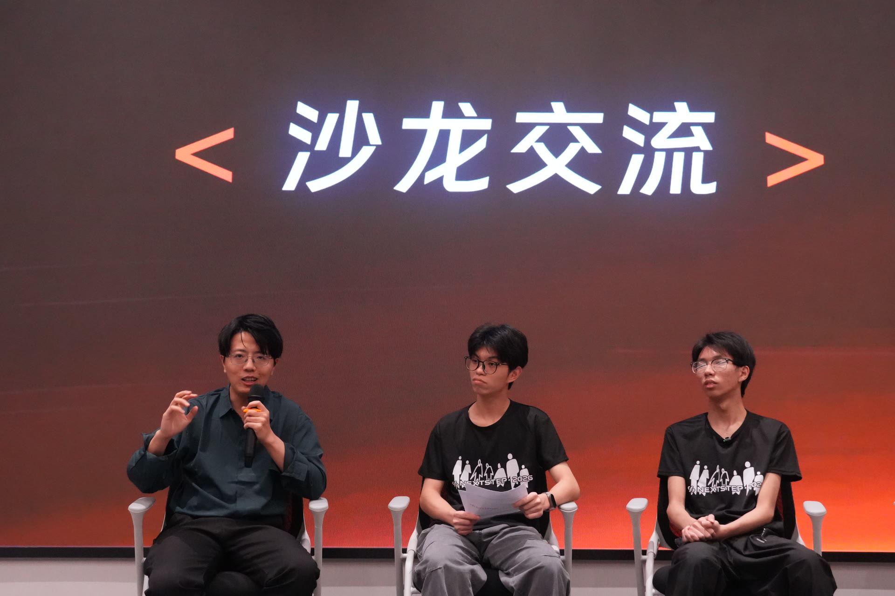
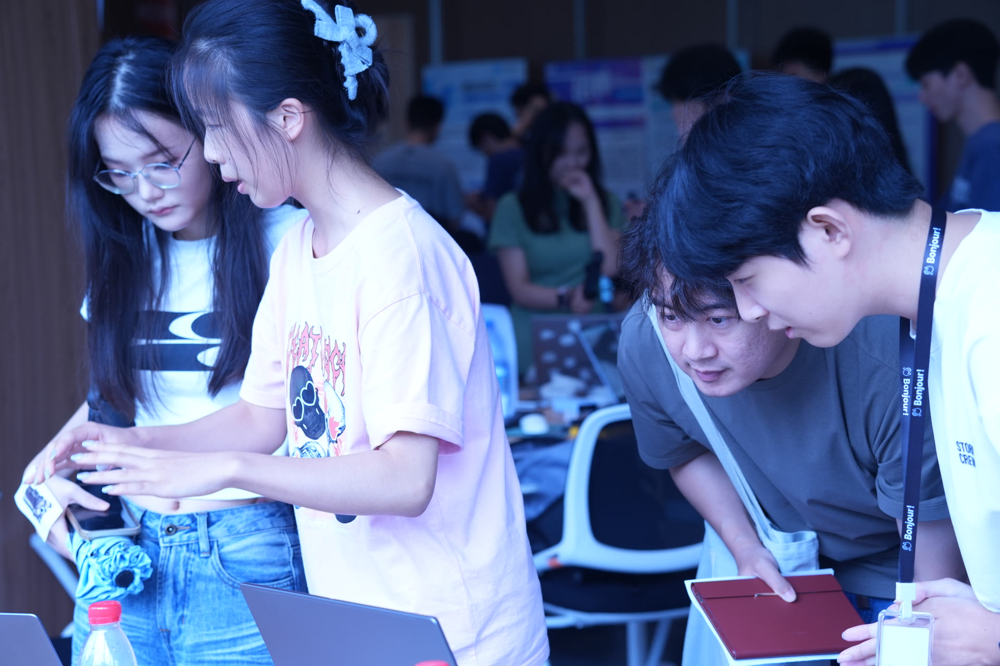
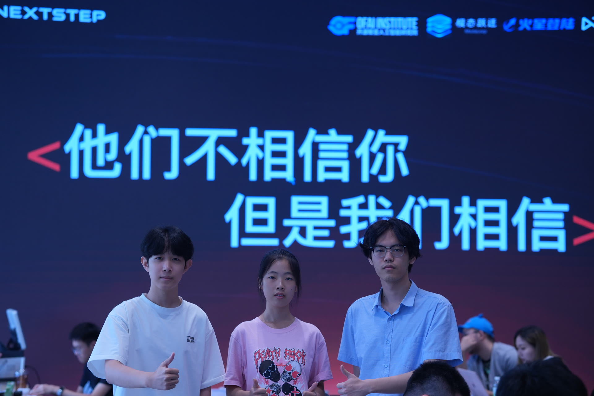
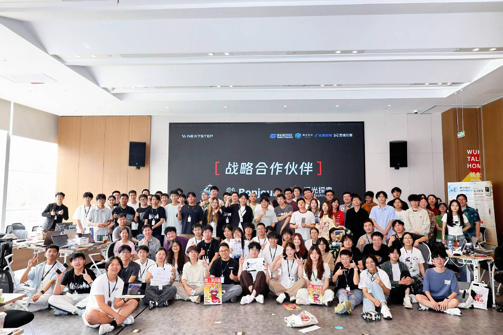

7 月初，我参加了在武汉市江汉区人才之家举办的“开源聚变 2026 全国 AI 创新大赛” NextStep 黑客松。这场活动由开源聚变人工智能研究院与 NextStep 组委会共同主办，约 120 位来自全国各地的开发者、创业团队与行业嘉宾齐聚一堂，共同开启了一场为期三天、连续 48 小时的技术盛会。

开幕式上，我认真聆听了开源聚变人工智能研究院副秘书长、武汉模态跃迁科技有限公司生态运营负责人陈梦琪的致辞。她提到，开源聚变人工智能研究院作为活动联合主办方，致力于连接开发者、企业场景、技术资源、投融资与市场渠道，为 AI 创新者提供长期的生态支撑。他们“不止办一场比赛”的决心，让我对接下来几天多了几分期待。随后，我与全体嘉宾和各位参赛选手一同合影留念，为创作之旅正式启程。

在开幕式设置的沙龙交流环节，我认真聆听了武汉模态跃迁科技有限公司 CEO、开源聚变人工智能研究院院长邴龙志结合自身经历的真诚分享。他为年轻开发者提供了宝贵的经验与思路，也让我意识到，很多技术之外的选择，同样会影响一个项目能走多远。

当晚，我与队友以及部分在大厂实习的前辈一同聚餐。席间，我认真倾听了他们关于创意落地的思路和项目运营的经验，也和大家互相交流了自己的创意。那顿饭更像一场非正式的路演预演，每个人都在试探、修正、碰撞。

4 日，所有参赛团队进入开发冲刺，甚至有人把键盘敲到了深夜。经过小组一致决定，我们由 @whisky 策划，由我主力开发一款面向团队的 AI 对话式能力测评平台，试图解决团队分工缺少合理性的痛点，进一步提高团队分工与效率。从策划、制定相关标准、确定技术栈到开发，团队每个人都争分夺秒。最后冲刺阶段，我们终于完成功能收尾与调试，也同步完成了路演所需的演示与讲解材料准备。

5 日下午一点，游园会开启。各参赛队伍现场布展、展示创意成果，现场人潮涌动，展位前交流不断，空气里都是演示、提问与讨论的声音。我们通过讲解演示、互动体验等方式向观众推介作品，得到了众多来自大众评审的好评。他们肯定了我们在团队协作场景中的切入点，也期待我们进一步打磨测评维度的科学性、提升交互体验，并探索更真实的团队数据接入方式。这些反馈直接而宝贵，让我们对产品的下一步有了更清晰的方向。

项目路演紧随其后。各队依次登台，在限定时间内介绍项目背景与思路、演示核心功能，并回答评委的现场提问，完成从开发到表达的最后一环。通过倾听来自技术、应用、投资等不同维度的专家评审，我们受益匪浅。这些建议对我们未来技术方案的合理性、产品落地的可行性，以及团队后续迭代的潜力，都有着长远影响。

路演结束后，评审团进行合议，综合各队的现场表现与作品情况给出评定。我深切感受到现场那种浓厚的对技术的渴望。三天过去，一批从 0 到 1 的可运行作品，一些经受住 48 小时检验的想法，以及在同一个场地里认识了彼此的青年开发者，都留在了我的这段记忆里。

想法这东西，放在脑子里的时候总是完美的。但只有被搬到台前，被追问、被质疑，它才开始真正接近现实。这三天里，我们的想法经历了很多次这样的时刻。它未必成熟，甚至未必正确，但它确实站到了现实面前，经受了一次现实的追问，这大概就是 NextStep 给我最好的东西。
